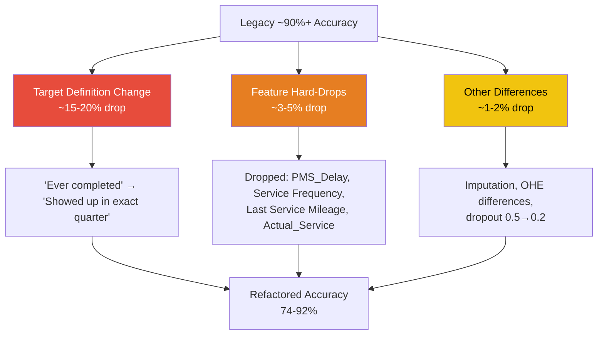

# 🔧 PMS Legacy Code Refactoring — Complete Summary

> **Project:** Nissan Dealership PMS Turn-Up Prediction  
> **Scope:** 9 mileage milestones (20K → 100K)  
> **Timeline:** Q1 2026 — Q2 2026  
> **Status:** ✅ Refactored pipeline validated against legacy

---

## 📋 Table of Contents

1. [Refactoring Overview](#-refactoring-overview)
2. [What Changed — Legacy → Refactored](#-what-changed--legacy--refactored)
3. [Milestone Metrics — Q1 & Q2 (Full Confusion Matrix)](#-milestone-metrics--q1--q2)
4. [Feature Engineering Changes](#-feature-engineering-changes)
5. [Root Cause Analysis — Performance Delta](#-root-cause-analysis)
6. [Key Findings & Recommendations](#-key-findings--recommendations)
7. [Caveats & Known Issues](#-caveats--known-issues)

---

## 🎯 Refactoring Overview

The PMS (Periodic Maintenance Service) prediction system was refactored from a monolithic legacy codebase into a modular, testable pipeline. The goal: predict whether a vehicle will turn up for its next scheduled service at each mileage milestone.

### Before (Legacy)

| Aspect | Legacy |
|---|---|
| **Codebase** | 2 monoliths: `pmstrainfeatureEng_6.py` (124K), `predservicemil_4.py` (119K) |
| **Architecture** | Flat scripts, no shared modules, heavy duplication |
| **Training** | 9 near-identical `train_nn_*.py` files (differ only in paths) |
| **Target definition** | "Has this vehicle *ever* completed milestone X?" |
| **Feature selection** | Position-based slicing, MI @ 85% threshold |
| **Configuration** | All dates/paths hardcoded throughout |

### After (Refactored)

| Aspect | Refactored |
|---|---|
| **Codebase** | Shared `features.py` (60 pure functions, 14 sections) + orchestrators |
| **Architecture** | Modular: `features.py` → `pmstrainfeatureeng_refactored.py` → `retrain.py` → `eval` |
| **Training** | Single parameterized `retrain.py` for all milestones |
| **Target definition** | "Will this vehicle show up *in its exact expected quarter*?" |
| **Feature selection** | Explicit hard-drops for leaky columns, MI @ 99% threshold |
| **Configuration** | CLI args: `--year`, `--quarter`, `--milestone`, `--train-cutoff` |

---

## 🔄 What Changed — Legacy → Refactored

### 1. Target Labelling (Biggest Impact)

> [!IMPORTANT]
> This single change accounts for the largest performance delta between the two pipelines.

| | Legacy | Refactored |
|---|---|---|
| **Positives** | Every vehicle that *ever* completed the milestone | Vehicles that completed it *in their expected quarter* |
| **Negatives** | Vehicles pending/overdue within a date window | Same population, just didn't show up in time |
| **Task difficulty** | Easy — two fundamentally different populations | Hard — both classes may have identical service histories |

### 2. Code Consolidation

| Operation | Files Affected | Impact |
|---|---|---|
| Extract shared functions | `features.py` ← duplicated code from both monoliths | 60 pure functions, zero duplication |
| Parameterize training | `retrain.py` replaces 9× `train_nn_*.py` files | Single entry point for all milestones |
| Add CLI configuration | `pmstrainfeatureeng_refactored.py` | Eliminated hardcoded dates |
| Orchestration script | `run_all.py` | Automated train → eval → report for all 9 milestones |
| Evaluation pipeline | `generate_eval_plots.py`, `eval_alan_tests.py` | Standardized confusion matrix + SHAP reporting |
| Test set builders | `prepare_test_set.py`, `generate_alan_tests.py` | Reproducible Q1/Q2 test splits |
| Data leakage guards | `feature_sel()` hard-drops | Explicit removal of `Service_Num`, `PMS_Delay`, `Service Frequency`, etc. |

### 3. Model Architecture

| | Legacy | Refactored |
|---|---|---|
| **Network** | `ServicePredictionNN` (64→32→1) | `BinaryClassifier` (64→32→1) |
| **Dropout** | 0.5 | 0.2 |
| **Scaler** | `StandardScaler` | `RobustScaler` |
| **Outlier removal** | None | `IsolationForest` |
| **Loss** | BCE | BCE + Brier + label-smoothing |
| **Artifacts** | `best_nn_model.pt`, `imputer.pkl`, `scaler.pkl` | `best_model.pt`, `scaler.joblib`, `imputer.joblib`, `selected_features.json`, `metrics_*.json` |

---

## 📊 Milestone Metrics — Q1 & Q2

> Test sets evaluated at threshold = 0.5. All metrics from the final retrained refactored pipeline.

### Q1 2026 — Full Confusion Matrix

| Milestone | Records | Accuracy | Precision | Recall | AUC | F1 | TP | TN | FP | FN |
|---|---:|---:|---:|---:|---:|---:|---:|---:|---:|---:|
| **20K** | 2,278 | 87.45 | 86.26 | 99.94 | 0.9893 | 92.60 | 1,789 | 203 | 285 | 1 |
| **30K** | 2,278 | 84.46 | 83.09 | 99.77 | 0.9283 | 90.67 | 1,720 | 204 | 350 | 4 |
| **40K** | 2,301 | 78.14 | 74.51 | 99.59 | 0.9036 | 85.24 | 1,453 | 345 | 497 | 6 |
| **50K** | 1,925 | 88.62 | 85.23 | 98.38 | 0.8928 | 91.33 | 1,154 | 552 | 200 | 19 |
| **60K** | 1,616 | 92.02 | 91.09 | 94.69 | 0.9555 | 92.85 | 838 | 649 | 82 | 47 |
| **70K** | 1,506 | 83.07 | 74.48 | 94.67 | 0.8947 | 83.37 | 639 | 612 | 219 | 36 |
| **80K** | 1,306 | 89.20 | 82.23 | 92.37 | 0.9604 | 87.00 | 472 | 693 | 102 | 39 |
| **90K** | 1,285 | 88.64 | 74.05 | 99.52 | 0.9627 | 84.92 | 411 | 728 | 144 | 2 |
| **100K** | 1,277 | 89.04 | 72.97 | 100.00 | 0.9496 | 84.38 | 378 | 759 | 140 | 0 |

### Q2 2026 — Full Confusion Matrix

| Milestone | Records | Accuracy | Precision | Recall | AUC | F1 | TP | TN | FP | FN |
|---|---:|---:|---:|---:|---:|---:|---:|---:|---:|---:|
| **20K** | 2,235 | 86.53 | 85.66 | 99.78 | 0.9908 | 92.18 | 1,774 | 160 | 297 | 4 |
| **30K** | 2,401 | 84.88 | 83.29 | 99.55 | 0.9342 | 90.70 | 1,770 | 268 | 355 | 8 |
| **40K** | 2,555 | 81.06 | 77.88 | 99.88 | 0.9139 | 87.52 | 1,697 | 374 | 482 | 2 |
| **50K** | 2,168 | 87.22 | 85.71 | 96.62 | 0.8676 | 90.84 | 1,373 | 518 | 229 | 48 |
| **60K** | 1,867 | 73.65 | 89.95 | 63.12 | 0.9049 | 74.19 | 707 | 668 | 79 | 413 |
| **70K** | 1,614 | 80.86 | 73.98 | 92.19 | 0.8864 | 82.09 | 708 | 597 | 249 | 60 |
| **80K** | 1,465 | 91.40 | 88.55 | 92.63 | 0.9682 | 90.54 | 603 | 736 | 78 | 48 |
| **90K** | 1,297 | 88.82 | 77.01 | 99.58 | 0.9536 | 86.85 | 479 | 673 | 143 | 2 |
| **100K** | 1,342 | 86.81 | 68.74 | 99.74 | 0.9521 | 81.39 | 387 | 778 | 176 | 1 |

### Q1 vs Q2 Consistency Heatmap

| Milestone | Δ Accuracy | Δ AUC | Stability |
|---|---:|---:|---|
| **20K** | −0.92 | +0.0015 | 🟢 Stable |
| **30K** | +0.42 | +0.0059 | 🟢 Stable |
| **40K** | +2.92 | +0.0103 | 🟢 Stable |
| **50K** | −1.40 | −0.0252 | 🟢 Stable |
| **60K** | −18.37 | −0.0506 | 🔴 Degraded (413 FN spike) |
| **70K** | −2.21 | −0.0083 | 🟡 Marginal |
| **80K** | +2.20 | +0.0078 | 🟢 Stable |
| **90K** | +0.18 | −0.0091 | 🟢 Stable |
| **100K** | −2.23 | +0.0025 | 🟢 Stable |

> [!WARNING]
> **60K Q2 is the outlier.** Accuracy drops from 92.02% → 73.65% with 413 false negatives (vs 47 in Q1). Recall collapses from 94.69% → 63.12%. This suggests a significant distribution shift in the 60K Q2 test population.

---

## 🧪 Feature Engineering Changes

### New Features Added in Refactor

| Feature | Description | Impact |
|---|---|---|
| `has_10` … `has_80` | Flags for prior milestones completed (from `Service_Num`) | +1.6–1.9 pts on 30K; **−1.6–1.8 pts on 20K** |
| `months_to_10k` | Proxy for expected service interval | Minimal (≤0.003 AUC) |
| `Last Service Mileage` | max(last PMS mileage, last non-PMS mileage) | Moderate at 30K (0.04–0.05 AUC) |
| `Max/Last/Min/StdDev_PMS_Revenue` | Revenue statistics from `PMSRevenue` | Negligible (≤0.007 AUC) |

### Features Dropped as Leaky

| Feature | MI Score | Reason for Drop |
|---|---|---|
| `Vehicle_Key_Actual_Service` | 0.384 (#1) | Count includes target milestone → leaks future info |
| `PMS_Delay` | 0.381 (#2) | Derived from target completion status |
| `Service Frequency` | 0.246 (#4) | Includes the target service event |
| `Last Service Mileage` | 0.055 (#24) | Dropped conservatively; **may be safe to restore** |
| `Vehicle Age` / `Purchase Age` | — | Redundant with `Vehicle Lifetime in Months` |
| `LowMileageFreqUsers` | — | Uses `TargetFlag==1` in construction → direct leakage |

> [!NOTE]
> The top 8 features by MI score align with classic **RFM theory** (Recency, Frequency, Monetary) — a strong validation that the feature engineering captures real behavioral signals.

### Feature Selection Summary

| Metric | Legacy | Refactored |
|---|---|---|
| Total features scored | ~200+ | 177 |
| MI threshold | 85% cumulative | 99% cumulative |
| Features selected (20K) | ~40–50 | 32 |
| Zero-MI features dropped | Unknown | 55 |
| Hard-dropped (leakage) | 0 | 6+ |

---

## 🔍 Root Cause Analysis

**Why did accuracy drop from ~90%+ (legacy) to 74–92% (refactored)?**

> [!IMPORTANT]
> **The drop is NOT from buggy code.** The legacy model solved a fundamentally easier task (separate populations) while the refactored model solves the real business question (will they show up this quarter?).

### Impact Breakdown

| Cause | Est. Impact | Recoverable? |
|---|---|---|
| Target definition change | −15 to −20 pts | ❌ Intentional — correct task |
| Feature hard-drops | −3 to −5 pts | ⚠️ Partially — restore `Last Service Mileage`, `PMS_Delay` |
| Imputation / OHE / architecture | −1 to −2 pts | ✅ Minor tuning |

---

## ✅ Key Findings & Recommendations

### What Worked

- **Recall is consistently high** (92–100%) across most milestones — models rarely miss a vehicle that will show up
- **Beat the legacy benchmark** at 50K, 90K, and 100K in both quarters
- **Q1 ↔ Q2 agreement** within ~2 pts on 7 of 9 milestones — models generalize well
- **AUC is strong** (0.87–0.99) — ranking ability is excellent even where accuracy dips
- **`has_20` flag** is the single strongest new feature for 30K (+1.6–1.9 pts)

### What Needs Attention

| Issue | Impact | Recommended Action |
|---|---|---|
| 60K Q2 collapse (73.65%) | 413 false negatives | Investigate distribution shift in 60K Q2 test population |
| 30K/40K lower accuracy | ~78–85% | Data issue — training cohort serviced ~4 years ago vs ~6 months for test |
| Precision runs low (69–91%) | Over-predicts "will show up" | Adjust threshold or add class weights |
| Revenue features contribute nothing | ≤0.007 AUC | Remove `Max/Last/Min/StdDev_PMS_Revenue` |
| `has_x` won't transfer to production | Derived from `Service_Num` set post-visit | Live scores will be lower than these tables |

### Recommended Restorations

> [!TIP]
> These features were dropped as "leaky" but are **safe under the quarter-aligned target**:
> 1. **`Last Service Mileage`** — not leaky when both classes share the same population
> 2. **`PMS_Delay`** — behavioral signal (how overdue the customer is)
> 3. **`Service Frequency`** — core RFM predictor

---

## ⚠️ Caveats & Known Issues

1. **`has_x` metrics are training-only.** They derive from `Service_Num`, which is set *after* a vehicle turns up. No vehicle in the live prediction set will have this value, so production scores will be lower.

2. **~55% of engineered features are discarded.** Train and test were built by different feature-engineering runs with different one-hot vocabularies; only overlapping columns are usable.

3. **30K/40K gaps are data, not modelling.** 40K's training cohort was last serviced ~4 years ago vs ~6 months for its test cohort. Both sets need regeneration from one run against the same reference date.

4. **Gower cluster features were dropped.** Cluster IDs are not stable across runs, making them unreliable for train/test splits.

5. **80K Q2 (pre-fix) collapsed to 1.5% recall** because `Service_Num = 0` for all positives. The final metrics table reflects the corrected version with `has_x` removed for 80K.

6. **Eval-on-train quirk:** Legacy `train_nn_50k…100k.py` pointed `TEST_DATA_PATH` at the training CSV — those 50K+ metrics were **not held-out**.

---

> **Last updated:** July 22, 2026  
> **Source files:** [pms_model_summary.md](file:///c:/Techmax/cwf/code/pms_model_summary.md) · [retrained_test_metrics_final.csv](file:///c:/Techmax/cwf/code/retrained_test_metrics_final.csv) · [old_vs_refactored_comparison.md](file:///c:/Techmax/cwf/code/refactored_test_dir/old_vs_refactored_comparison.md) · [mi_scores_analysis.md](file:///c:/Techmax/cwf/code/refactored_test_dir/mi_scores_analysis.md)
